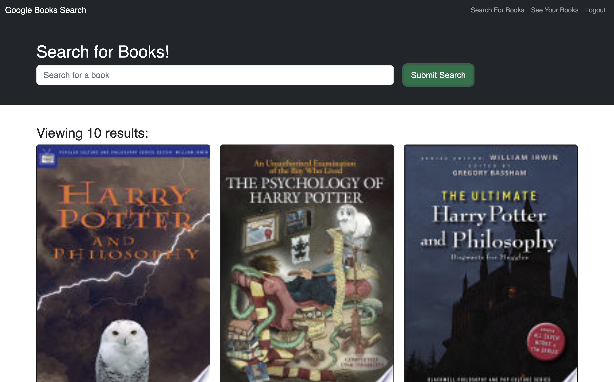

# Book Search Engine 

## **Usage**

This app is a search engine that users can use to search for books. If a user creates an account and logs in, they also will have the capability to save books to their favorites list.

## **Description**

This app was created using MongoDB, GraphQL, Apollo Sever and React.

> Note: I am having issuse with saving the books and will have a deployed page when I fix the bug. Aside from that everyhting is functioning properly.